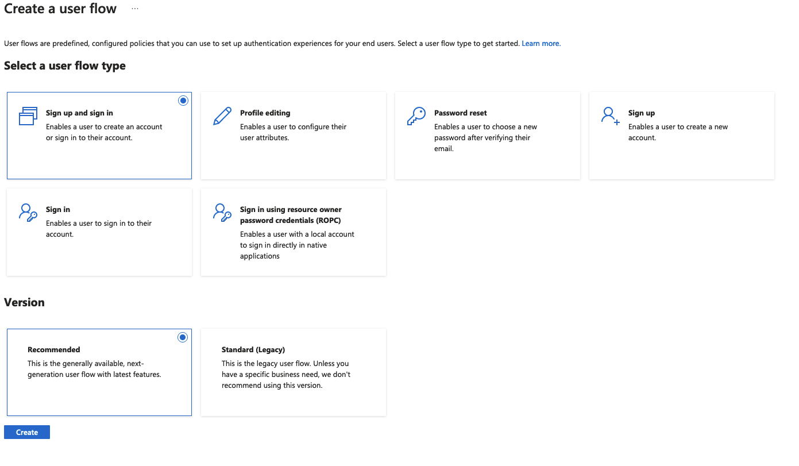
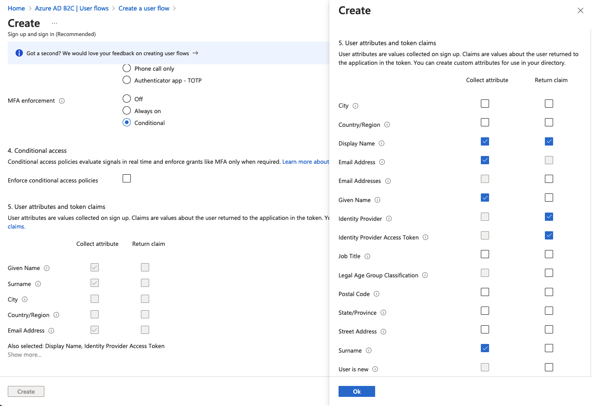

# Blazor Server with AzureB2C Authentication calling a gRPC Service with AzureB2C Authentication
Because this took me hours to figure out and multiple resources and rabbit holes I thought I would share my findings.
You should be able to setup your AzureB2C, create the Application Registrations, input the values in the appsettings.json files
and you're good to go.

## WARNING: NOT PRODUCTION READY
There's a lot of things that make this code not ready for production use and I've sprinkled comments throughout the code
letting you know where I've been lazy. The debug logs will also be telling you all that is wrong. Perhaps one day I'll update it so its ready to go but today is not that day. 

You'll see at the bottom of this README that there is one bug that breaks the entire app unless you insert code that should never go into production.

## App Structure
The solution is made up of 3 projects:
- Gilboy.API: A gRPC service that is protected by AzureB2C
- Gilboy.Web: A Blazor Server application that is protected by AzureB2C
- Gilboy.Messages: A shared project that contains the proto files for the gRPC service

## How it works
Check out the `.csproj` files in both application, it shows how they reference the `Protos` directory in the `Gilboy.Messages` project. They don't directly reference the project like you normally would, the class library is just a way to keep things organized.

The rest of the stuff is in the `Program.cs` files, `appsettings.json` and added a `GreeterWebService` in `Gilboy.Web.Data` that calls the gRPC service. Other than that it's the same projects that are created from templates.

## Happy Path
Hopefully it is for you although there are a lot of hot stoves just waiting to be touched.

### AzureB2C Setup
I've already deleted this AzureB2C Tenant so the values in the appsettings.json files are not valid. You'll need to create your own.

1. Create an AzureB2C Tenant
2. Create a Sign In/Sign Up User Flow

- I just used email and named it `susi` for Sign Up Sign In

- I am capturing more info but only asking to send to the apps a few pieces of info

3. Register the Web Application
- Note I put the incorrect Redirect URI in the screenshot but we fix it later

- See, fixed. Also added signout redirect and ticked both boxes for ID and Access tokens

4. Add client secret to Web Application Registration

5. Register the API Application
- Note that I left the redirect uri blank, there's no need for once since you can only hit the api from the web app

6. Expose an API on the API Application
- I didn't use the default Application Id URI, they use the client id guid, I just made it `/api`

7. Create a Scope on the API we created to access the API as the user

- Scope is created.

8. Grant Web App permissions to the the API Scope
- I'm not sure if this is necessary or not but I did it anyway

### Add the values to the appsettings.json files
It's pretty much copy/pasta replacing the values with the ones you created in AzureB2C

### Startup the API App (Very Important)
If you don't you'll just get an error in the web app complaining about not being able to connect to the API.

### Start the Web App and Register an Account
You should be redirected to a page that looks like this

### See your User Name
If all works you should see your user name in the message.

## Hot Stoves
Here's some stuff I've run into that you might too.

### MsalUiRequiredException
This happens everytime you restart the web app. FUN! I'm sure it can be solved but again, I'm tired and will figure it out another day.

#### The Workaround
Delete all the session cookies and reload the page. You should be good to go.

### RpcException: Status(StatusCode="Unauthenticated", Detail="Bad gRPC response. HTTP status code: 401")
It's because the token we try to get in `AddCallCredentials()` comes back null.

#### The Workaround
It's a bad one, very very bad one. You add `IdentityModelEventSource.ShowPII = true;` to `builder.Services.AddAuthorization`.

I'm not joking, try it out. Maybe all these deal with local development but I haven't deployed my services yet so I can't say for sure.

## Resources
Thanks to all these people for their help in getting this working. These are in no particular order, just pasting as they are open in my browser.
- https://stackoverflow.com/questions/54435551/invalidoperationexception-idx20803-unable-to-obtain-configuration-from-pii
- https://stackoverflow.com/questions/75626962/how-could-do-the-authentication-and-authorization-in-a-grpc-service-in-a-asp-cor
- https://stackoverflow.com/questions/59700833/unable-to-resolve-service-for-type-microsoft-identity-web-itokenacquisition-wh
- https://stackoverflow.com/questions/75542322/unable-to-resolve-service-for-type-microsoft-identity-web-microsoftidentitycon
- https://github.com/grpc/grpc-dotnet/blob/master/examples/Blazor/Client/Client.csproj
- https://learn.microsoft.com/en-us/aspnet/core/grpc/clientfactory?view=aspnetcore-7.0#call-credentials
- https://www.josephguadagno.net/2020/06/26/connecting-to-an-api-protected-by-microsoft-identity-platform
- https://learn.microsoft.com/en-us/samples/azure-samples/active-directory-aspnetcore-webapp-openidconnect-v2/how-to-secure-a-web-api-built-with-aspnet-core-using-the-azure-ad-b2c/
- https://github.com/Azure-Samples/active-directory-aspnetcore-webapp-openidconnect-v2/blob/master/4-WebApp-your-API/4-2-B2C/TodoListService/Startup.cs